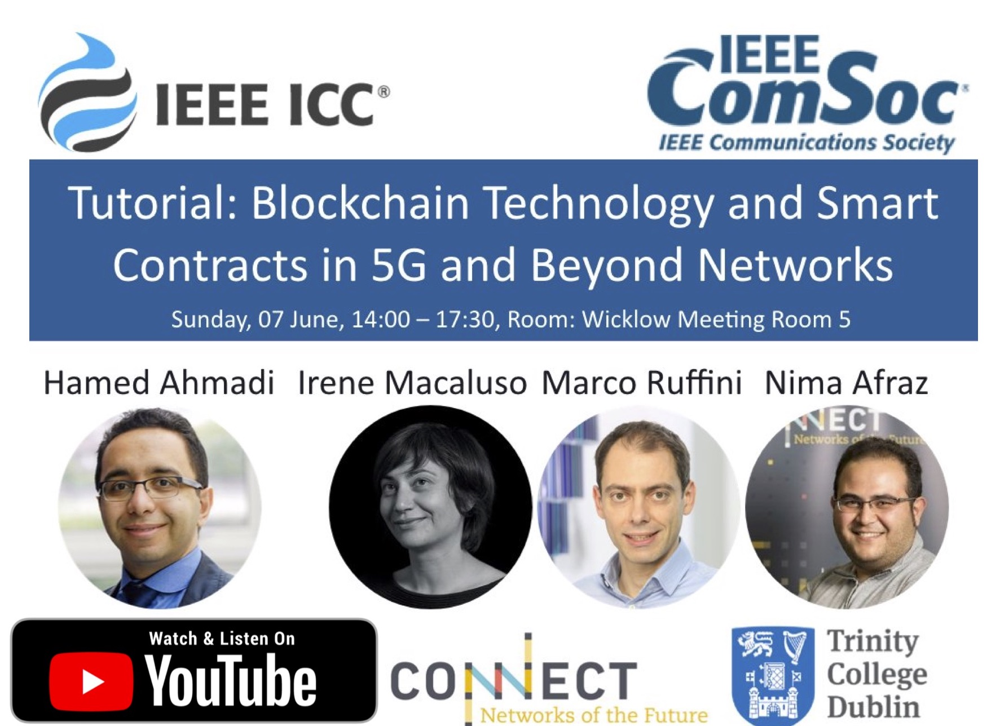

<!-- []
 -->

      
    

**Abstract:**

The Business ecosystem in Telecom industry is undergoing an evolution which introduces more sophisticated and highly frequent processes such as financial transactions and sensitive intelligence sharing which conventional manual negotiation-based systems are incapable of handling. These are not limited to financial Blockchain technology facilitates the automation of business processes and provides collaboration incentives in enterprise ecosystems. This is done through eliminating the need for a third-party authority to overlook the transactions with a collaborative consensus protocol which enhances the system with security, transparency and fault/manipulation tolerance. In this tutorial we will explain how blockchain technology will enable the industry to upgrade its business process management to accommodate the requirements for the 5G and beyond networks.

**Speakers:**

Hamed Ahmadi is an assistant professor in the department of Electronic Engineering, University of York, UK and an adjunct assistant professor in the school of EEE, University College Dublin, Ireland. He received his Ph.D. from National University of Singapore in 2012. Dr. Ahmadi has published more than 50 peer reviewed book chapters, journal and conference papers. Dr. Ahmadi is an editor of Frontiers in Blockchain, IEEE Access and Springer wireless networks journal and he was selected as an exemplary reviewer of IEEE Communications Letters in 2014. He is a senior member of IEEE, a Fellow of UK Higher Education Academy, and the Networks working group co-chair and management committee member of COST Action 15104 (IRACON).

Irene Macaluso received the Ph.D. degree in robotics from the University of Palermo, Palermo, Italy, in 2007. She is a Senior Research Fellow with Research Centre for Future Networks and Communications (CONNECT), Trinity College, Dublin, Irelands. Her research interests include adaptive wireless resource allocation, with particular focus on the design and analysis of market-based mechanisms in the management and operation of reconfigurable wireless networks and the application of machine learning to radio resource sharing. She is the author of more than 70 papers in internationally peer-reviewed journals and conferences. Dr. Macaluso has been an Executive Editor for the Transactions on Emerging Telecommunication Technologies since 2016. She is also an editor of Frontiers in Blockchain.

Marco Ruffini received the M.Eng. degree in telecommunications from Polytechnic University of Marche, Ancona, Italy, in 2002 and the Ph.D. degree from Trinity College Dublin (TCD), Dublin, Ireland, in 2005. After working as a research scientist for Philips in Germany, he joined TCD in 2005. Since 2010, he has been an Assistant Professor (tenured 2014) at TCD. He is Principal Investigator both at the CONNECT Telecommunications Research Centre at TCD and at the IPIC research centre in Photonics, based in the Tyndall National Institute. He is currently involved in several Science Foundation Ireland and H2020 projects, and leads the Optical Network Architecture group at TCD. He is the author of more than 120 journal, conference publications and book chapters and holds more than 10 patents. His research interests include flexible and shared high-capacity fibre broadband architectures and protocols, network convergence and software defined networks control planes.

Nima Afraz is a doctoral candidate in the CONNECT Centre, Trinity College Dublin. His research focuses on multi-tenant/service optical access networks enabled by virtualisation techniques. Nima has developed an interest for interdisciplinary approaches to solving the economic incentives in optical network infrastructure sharing.
