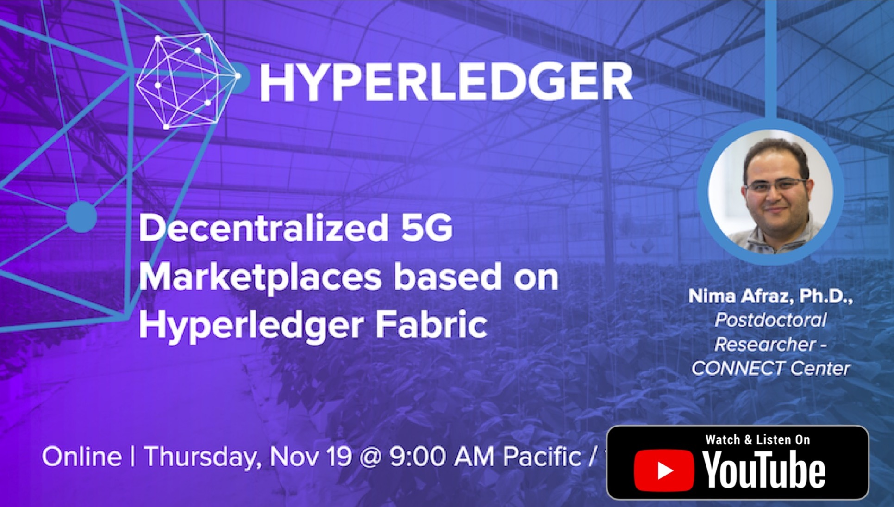

<!-- []
 -->

      
    

A presentation hosted by Hyperledger’s Telecom Special Interest Group. In this talk, Nima Afraz, Ph.D., Postdoctoral Researcher at CONNECT Center in Trinity College Dublin discusses how Hyperledger Fabric could facilitate the implementation of a distributed marketplace for 5G network infrastructure sharing which does not rely on a central source of trust.
