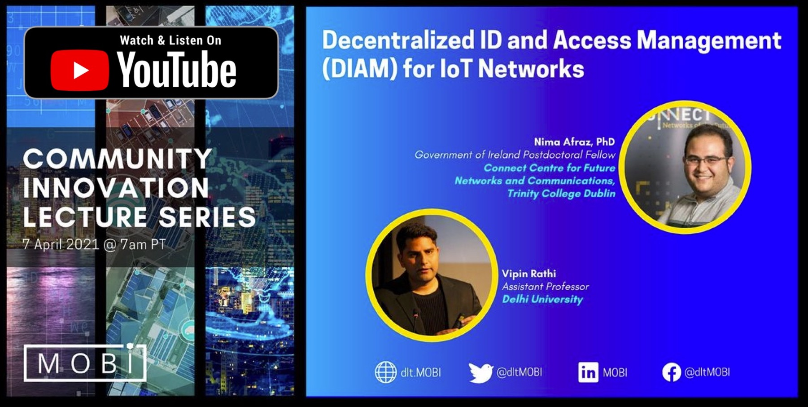

<!-- []
 -->

      
    

The Telecom Special Interest group, in collaboration with the Linux Foundation’s LF Edge initiative, has published a solution brief addressing the issues concerning the centralized ID and Access Management (IAM) in IoT Networks and introducing a distributed alternative using Hyperledger Fabric.

In this lecture, you will learn about a decentralized approach to validate and verify the identity of IoT devices, data, and applications. In particular, the proposal to use two frameworks from the Linux Foundation: Hyperledger Fabric for the distributed ledger (DLT) and Hyperledger Indy for the decentralized device IDs. These two blockchain frameworks provide the core components to address end-to-end IoT device ID and access management (IAM).

**About Nima and Vipin**

Nima Afraz received his PhD in computer science from Trinity College Dublin, Ireland, in 2020. His research focuses on blockchain applications in telecoms, the economics of networks and network virtualisation. He is currently a government of Ireland postdoctoral fellow at CONNECT Centre, working to address the challenges in the adoption of blockchain technology in telecommunications. Nima is the vice-chair of the Linux Foundation’s Hyperledger telecom special interest group.

Vipin Rathi is currently working as an Assistant Professor in University of Delhi. Vipin is the Chair of the Linux Foundation Hyperledger Telecom Special Interest group. His research focuses on Blockchain, Edge Computing, Multi & Hybrid cloud, Post Quantum Cryptography. He is an active member of many open source foundations and standard bodies.
